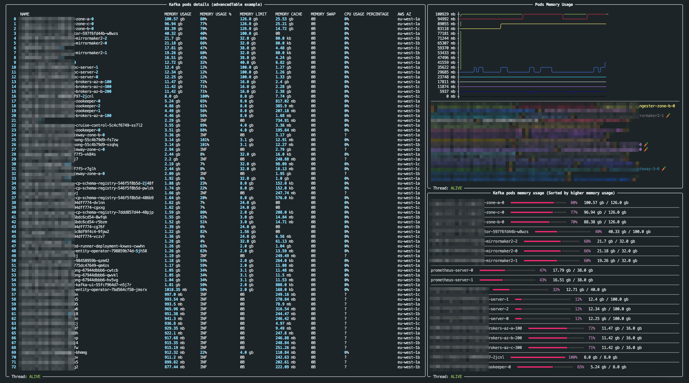
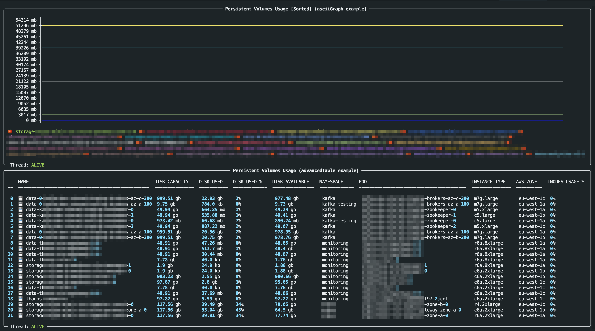

# Kube-Prometheus-Top [ kptop ]

A Python tool that offers beautiful CLI monitoring based on Prometheus metrics, with Kubernetes integration through PodPortForward

Allowing you to create your own custom CLI dashboards & CLI commands with custom layouts, variables, CLI arguments !

<br>

# Motivation
Prometheus is widely used with different kinds of metrics - Let's make CLI monitoring more powerful with Prometheus data.


<br>

---


# Installation

> Compatible with Python 3.6+

[on PyPi](https://pypi.org/project/kptop)

```bash
pip3 install kptop --upgrade
```

<br>

---


## Environment Variables
<a id=env></a>

| ENV | Description                                                                          | Default | Required |
| ----- | -------------------------------------------------------------------------------------- | --------- | ---------- |
| `KPTOP_CONNECTION_METHOD`    | The way to connect to Prometheus server<br />**options:** ['prometheus_endpoint', 'pod_portForward'] | <br />      | Yes      |

There are 2 options to connect KPtop to Prometheus:
1. With a Prometheus server endpoint
    - Suitable if Prometheus is exposed (with an ingress for example)
2. With 'K8s pod port-forward' (Through K8s API-Server)
    - Suitable if Prometheus is Not exposed (Only rechable with K8s cluster access)


#### `prometheus_endpoint` ENVs

| ENV | Description                                                     | Default | Required |
| ----- | ----------------------------------------------------------------- | --------- | ---------- |
| `KPTOP_PROMETHEUS_SERVER`    | Prometheus server URL                                           |         | Yes      |
| `KPTOP_BASIC_AUTH_ENABLED`    | Whether basic authentication is needed to connect to Prometheus | False   | No       |
| `KPTOP_PROMETHEUS_USERNAME`    | Prometheus username                                             |         | No       |
| `KPTOP_PROMETHEUS_PASSWORD`    | Prometheus password                                             |         | No       |
| `KPTOP_INSECURE`    | Verify SSL certificate                                          | False   | No       |


<br>

#### `pod_portForward` ENVs

| ENV | Description                                            | Default | Required |
| ----- | -------------------------------------------------------- | --------- | ---------- |
| `KPTOP_PROMETHEUS_POD_NAME`    | Prometheus pod name                                    |         | Yes      |
| `KPTOP_PROMETHEUS_POD_PORT`    | Prometheus port number                                 | 9090    | No       |
| `KPTOP_PROMETHEUS_POD_NAMESPACE`    | The name space in which the Prometheus pod is deployed | default | No       |
| `KUBECONFIG`    | custom K8s kube config file                            | *default path*        | No       |


<br>

#### General ENVs

| ENV                                  | Description                                                  | Default               | Required |
| ------------------------------------ | ------------------------------------------------------------ | --------------------- | -------- |
| `KPTOP_START_GRAPHS_WITH_ZERO`       | By default graphs begin with '0'  to let the graph take its full hight | True                  | NO       |
| `KPTOP_LOGGING_DIR`                  | Choose a different logging directory                         | /tmp/                 | NO       |
| `KPTOP_GRAPH_WIDTH`                  | Choose a custom graphs width                                 | 45                    | NO       |
| `KPTOP_DEFAULT_DASHBOARDS_DIRECTORY` | Default directory contains the dashboards yaml files         | /var/kptop/dashboards | NO       |
| `KPTOP_DEFAULT_COMMANDS_DIRECTORY`   | Default directory contains the commands yaml files           | /var/kptop/commands   | NO       |


<br>

---

# CLI Arguments
<a id=cli></a>


| ENV                         | Description                                                  |
| --------------------------- | ------------------------------------------------------------ |
| `--dashboard` , `-D`        | Specify a dashboard YAML file                                |
| `--command` , `-C`          | Specify a command YAML file                                  |
| `--list-dashboards` , `-ld` | List all the available dashboards                            |
| `--list-commands` , `-lc`   | List all the available commands                              |
| `--debug`,  `-d`            | Enable debugging logging mode                                |
| `--version`,  `-V`          | Show kptop version                                           |
| `--print-layout`,  `-pl`    | Print the dashboard empty layout                             |
| `--vhelp` ,  `-vh`          | Print the arguments including "the variables arguments defined in your command yaml file" |


<br>

---


# Usage


## [1] Add the Prometheus connection Environment Variables

## Example

<br>

Add the ENVs and you're good to go.

_*Examples*_

```bash
export KPTOP_CONNECTION_METHOD="pod_portForward"
export KPTOP_PROMETHEUS_POD_NAME="my-prometheus-server-0"
export KPTOP_PROMETHEUS_POD_PORT="9090"
export KPTOP_PROMETHEUS_POD_NAMESPACE="monitoring"
```

> Or

```bash
export KPTOP_CONNECTION_METHOD="prometheus_endpoint"
export KPTOP_PROMETHEUS_SERVER="http://prometheus.home-lab.com"
```


<br>

## [2] Configure the location of your dashboards & commands


Example:

```bash
export KPTOP_DEFAULT_DASHBOARDS_DIRECTORY="/Users/YOU/kptop/examples/dashboards"
export KPTOP_DEFAULT_COMMANDS_DIRECTORY="/Users/YOU/kptop/examples/dashboards"
```


## Run dashboards / commands !

### [Dashboards Doc](./dashboards/)
### [Commands Doc](./commands/)


```bash
kptop --list-dashboards
```

```
DASHBOARD      CREATION TIME        UPDATE TIME
pods           29-06-2024 19:43:19  29-06-2024 19:43:19
test           29-06-2024 19:27:04  29-06-2024 19:27:04
pvcs           29-06-2024 12:33:02  29-06-2024 12:33:02
strimzi-kafka  29-06-2024 12:33:02  29-06-2024 12:33:02
```

> [Example dashboard | pods.yml](../examples/commands/pods-wide.yml)


```bash
kptop --dashboard pods
```



<br>

> [Example dashboard | pods.yml](../examples/commands/pods-wide.yml)

```bash
kptop --dashboard pvcs
```




<br>


```bash
kptop --list-commands
```

```
COMMAND    CREATION TIME        UPDATE TIME
pods       29-06-2024 12:33:02  29-06-2024 12:33:02
pvcs       29-06-2024 12:33:02  29-06-2024 12:33:02
pods-wide  29-06-2024 12:33:02  29-06-2024 12:33:02
```


> [Example command | pods-wide.yml](../examples/commands/pods-wide.yml)

```bash
kptop --command pods-wide -n kafka
```

```
NAME                                               MEMORY REQUESTS    MEMORY LIMITS    CPU REQUESTS    CPU LIMITS    NODE                                       ARCH    INSTANCE TYPE    AWS AZ      CAPACITY TYPE
kafka-test-entity-operator-798859b74d-5jh58        1.0 gb             2.0 gb           0.4             2.0           ip-0-0-16-205.eu-west-1.compute.internal   amd64   m5.xlarge        eu-west-1a  on-demand
kafka-test-cp-schema-registry-546f5f8b5d-2j48f     6.0 gb             8.0 gb           0.5             1.0           ip-0-0-16-205.eu-west-1.compute.internal   amd64   m5.xlarge        eu-west-1a  on-demand
kafka-test-cruise-control-5c4cf6749-ss7l2          512.0 mb           2.0 gb           1.0             2.0           ip-0-0-16-205.eu-west-1.compute.internal   amd64   m5.xlarge        eu-west-1a  on-demand
kafka-test-strimzi-canary-8686978cb7-dbrf4         64.0 mb            64.0 mb          0.1             0.1           ip-0-0-16-205.eu-west-1.compute.internal   amd64   m5.xlarge        eu-west-1a  on-demand
kafka-test-brokers-az-c-300                        5.0 gb             8.0 gb           1.0             2.0           ip-0-0-184-231.eu-west-1.compute.internal  arm64   m7g.large        eu-west-1c  on-demand
kafka-test-brokers-az-a-100                        5.0 gb             8.0 gb           1.0             2.0           ip-0-0-60-93.eu-west-1.compute.internal    arm64   m7g.large        eu-west-1a  on-demand
kafka-test-cp-schema-registry-546f5f8b5d-486b9     6.0 gb             8.0 gb           0.5             1.0           ip-0-0-30-147.eu-west-1.compute.internal   amd64   m5.xlarge        eu-west-1a  on-demand
kafka-test-testing-kafka-k8s-exporter-6fb7c6dqknnl 512.0 mb           1.0 gb           0.1             0.3           ip-0-0-16-205.eu-west-1.compute.internal   amd64   m5.xlarge        eu-west-1a  on-demand
kafka-test-kafka-exporter-c58966cd6-r2tsj          256.0 mb           512.0 mb         0.1             0.5           ip-0-0-16-205.eu-west-1.compute.internal   amd64   m5.xlarge        eu-west-1a  on-demand
kafka-test-kafdrop-67ff5d5b4-77khq                 256.0 mb           1.0 gb           0.2             0.5           ip-0-0-16-205.eu-west-1.compute.internal   amd64   m5.xlarge        eu-west-1a  on-demand
kafka-test-brokers-az-b-200                        5.0 gb             8.0 gb           1.0             2.0           ip-0-0-100-105.eu-west-1.compute.internal  arm64   m7g.large        eu-west-1b  on-demand
kafka-test-kafka-ui-55fcf964d7-n5j7r               256.0 mb           1.0 gb           0.2             0.5           ip-0-0-16-205.eu-west-1.compute.internal   amd64   m5.xlarge        eu-west-1a  on-demand
kafka-test-zookeeper-0                             2.0 gb             4.0 gb           1.0             2.0           ip-0-0-30-147.eu-west-1.compute.internal   amd64   m5.xlarge        eu-west-1a  on-demand
kafka-test-zookeeper-2                             2.0 gb             4.0 gb           1.0             2.0           ip-0-0-155-163.eu-west-1.compute.internal  amd64   m5.xlarge        eu-west-1c  on-demand
kafka-test-cp-schema-registry-546f5f8b5d-pwlzk     6.0 gb             8.0 gb           0.5             1.0           ip-0-0-155-163.eu-west-1.compute.internal  amd64   m5.xlarge        eu-west-1c  on-demand
burrow-release-kafka-burrow-79c657bfff-q4lx7       128.0 mb           256.0 mb         0.1             0.1           ip-0-0-30-147.eu-west-1.compute.internal   amd64   m5.xlarge        eu-west-1a  on-demand
kafka-test-zookeeper-1                             2.0 gb             4.0 gb           1.0             2.0           ip-0-0-71-148.eu-west-1.compute.internal   amd64   c5.large         eu-west-1b  on-demand
kafka-test-cruise-control-ui-569ccc5897-8jqdq      ?                  ?                ?               ?             ip-0-0-33-177.eu-west-1.compute.internal   amd64   c5.large         eu-west-1a  on-demand
kafka-test-cruise-control-ui-569ccc5897-zl987      ?                  ?                ?               ?             ip-0-0-33-177.eu-west-1.compute.internal   amd64   c5.large         eu-west-1a  on-demand
```
